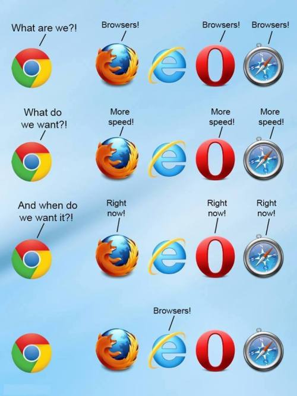

# ECMAScript 6&7

### Constants, block-scoped variables
```javascript
const constant = {value: 1}
constant = 2 // Uncaught TypeError: Assignment to constant variable.

let local = constant
local.value = 2
console.log(constant.value) // 2
```
```javascript
for (let i = 0; i < 3; i++) {
    console.log(i) // 0, 1, 2
}

console.log(i) // Uncaught ReferenceError: i is not defined
```
### Arrow Functions  
```javascript
const log = (value) => {
    console.log(value)
}
log(3) // 3

const shortVersion = value => console.log(value)
shortVersion(3) // 3
```
### Default values, object properties  
```javascript
const sum = (a =1, b = 2) => a+b
sum() // 3
sum(2, 2) // 4
```
```javascript
const name = 'name'
const value = 'value'
const object = {name, value}
console.log(object) // Object {name: "name", value: "value"}
```
```javascript
const object = {
    name: 'objectName',
    value: 'objectValue',
    type: 'objectType'
}
const {name, type} = object
console.log(name) // objectName
console.log(type) // objectType
```
### Spread Operator  
```javascript
const array = [1, 2, 3]
const extended = [...array, 4]
console.log(extended) // [1, 2, 3, 4]
```
### String templates  
```javascript
const cat = 'Tom'
console.log(`My cat's name is ${cat}`)
```
### Classes  
```javascript
class Shape {
    draw() {
        console.log('shape')
    }
}

class Square extends Shape {
    draw() {
        console.log('square')
    }
}

const shape = new Shape()
const square = new Square()
console.log(shape.draw()) // shape
console.log(square.draw()) // square
```
### Modules  
```javascript
//module.js
export const one = 1
const cat = 'Tom'
const sum = (a, b) => a + b
export {cat, sum}

export default class Shape {}
```
```javascript
import * from './module' // one, cat, sum, Shape
import Shape from './module'
import {cat, one} from './module' // cat, one
```
### Promises  
```javascript
const asyncFetch = (url) => {
    return new Promise((resolve, reject) => {
        // request data from a service
        let result = fetch(url)
        resolve(result)
    })
}

asyncFetch('https://user.api/user').then((user) =>
    console.log(user)
).catch((error) => {
    console.log(error)
})
```
### Generators  
```javascript
function* sequence(start) {
    var index = start
    while(true) {
        yield ++index
    }
}

const seq = sequence(-1)
console.log(seq.next()) // Object {value: 0, done: false}
console.log(seq.next()) // Object {value: 1, done: false}

for (let value of seq) {
	if (value > 5) {
		break
    }
	console.log(value) // 2, 3, 4, 5
}
```  
### Array Element Finding  
```javascript
const numbers = [1, 3, 7, 2]
console.log(numbers.find(x => x > 3)) // 7
console.log(numbers.findIndex(x => x > 3)) // 2
console.log(numbers.includes(5)) // false
```

# Babel
Transforms your code to browser readable format.
Supports ES6, ES7, ES8, React  
[Try it out](https://babeljs.io/repl/#?babili=false&evaluate=true&lineWrap=false&presets=es2015%2Creact%2Cstage-2&targets=&browsers=&builtIns=false&debug=false&code_lz=Q)

# Node.js 
### Quick overview
It is an open source framework based on Chrome V8 JavaScript engine.
[Download and install](https://nodejs.org/en/download/current/)  
> brew install node 

Web server in a few seconds:  

```javascript
const http = require('http');

const hostname = '127.0.0.1';
const port = 3000;

const server = http.createServer((req, res) => {
  res.statusCode = 200;
  res.setHeader('Content-Type', 'text/plain');
  res.end('Hello World\n');
});

server.listen(port, hostname, () => {
  console.log(`Server running at http://${hostname}:${port}/`);
});
```
>#### Exercise 1
Develop an api to return a list of events. Each event should contain label, description and date

### npm
[Node package manager](https://www.npmjs.com/) allows to share and reuse JS code
  
> To start new project  
> **npm init**  
> 
> To install project dependencies  
> **npm install** or **npm i** 
> 
> Add a project dependency(library)  
> **npm install -S library_name**  
 
### yarn
[Great alternative to npm](https://yarnpkg.com/en/)  
[Download and install](https://yarnpkg.com/en/docs/install#mac-tab)
> To start new project  
> **yarn init**  
> 
> To install project dependencies  
> **yarn install** or **yarn** 
> 
> Add a project dependency(library)  
> **yarn add library_name**  

Main features:  

* yarn.lock file  
* Parallel installation  
* Cache


# Webpack
[More than build system](https://webpack.js.org/)  
## Concepts:
### Entry
Contextual root. The main file of your app.  

```javascript
module.exports = {
  entry: './path/to/my/entry/file.js'
};
```
### Output
Processed data

```javascript
module.exports = {
  output: {
    path: path.resolve(__dirname, 'dist'),
    filename: 'my-first-webpack.bundle.js'
  }
};
```
### Loaders
To transform assets into modules

```javascript
module.exports = {
  module: {
    rules: [
      { test: /\.css$/, use: 'css-loader' }
    ]
  }
};
```
### Plugins
To perform actions

```javascript
module.exports = {
  plugins: [
    new webpack.optimize.UglifyJsPlugin()  ]
};
```

> #### Homework 1
> Add an endpoint to the api to request an event by id. Node **url** module may be useful
